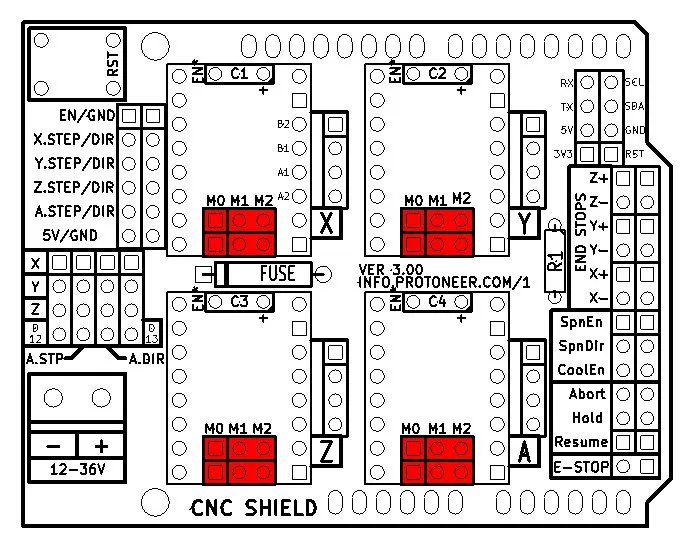
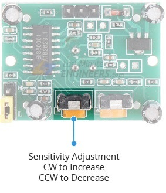
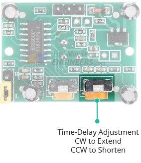

# Wiring Instructions

Initial wiring instruction for the CNC machine may be found [here](https://www.youtube.com/watch?v=XYqx5wg4oLU)

## Motion sensor PCB

We are using the power supply for the A-Axis motor driver to power the motion sensor PCB. The PCB itself is a simple inverter circuit, pulling the `Resume` pin low when motion is detected.

When motion is detected by the PIR sensor, the LED on the PCB lights up to indicate motion. A jumper is used on the PCB to enable the LED, and may be removed if the LED will not be used.

### Tuning the PIR sensor

Two screws are used on the PIR sensor to adjust motion sensitivity and time delay, shown below.

